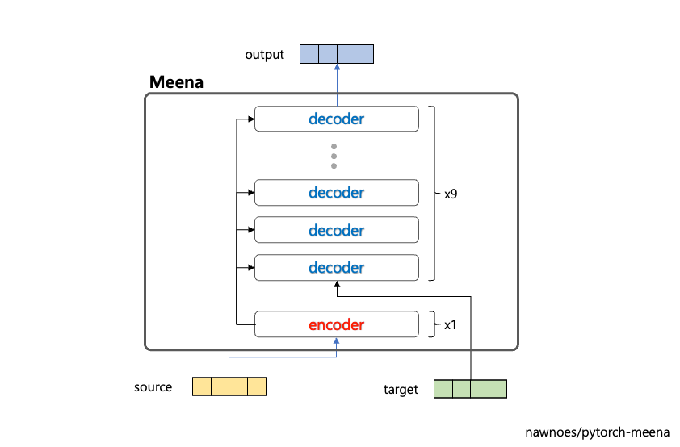
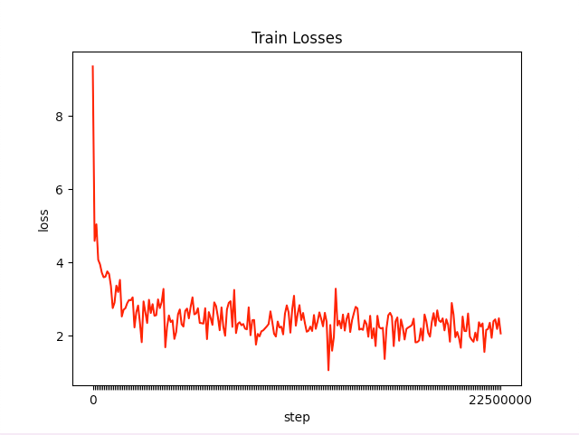

# Meena - Pytorch 
Implementation of Meena for open domain conversation using pytorch. 
The model in this repo use vanilla Transformer seq2seq model (not Evolved Transformer).
The model consists of 1 encoder and 9 decoder.  

## Model
### Meena
Transformer seq2seq model.


### Model Summary
- Total Prameters: **1.1B**(1,100,293,120)
```
-----------------------------------------------------------------------
      Layer (type)        Output Shape         Param #     Tr. Param #
=======================================================================
    MeenaEncoder-1      [1, 128, 2560]     104,604,160     104,604,160
    MeenaDecoder-2      [1, 128, 2560]     970,083,840     970,083,840
       LayerNorm-3      [1, 128, 2560]           5,120           5,120
          Linear-4     [1, 128, 10000]      25,600,000      25,600,000
=======================================================================
Total params: 1,100,293,120
Trainable params: 1,100,293,120
Non-trainable params: 0
-----------------------------------------------------------------------
```


## Vocab
This repo use **10K Wordpiece BPE**. Original Meena use sentencepiece library. Meena team use a vocabulary of **8K BPE**, which they found in early experiments to be sufficient for generating specific response. 


## Data
**Pretraining Data**  
- 34GB Korean corpus data 

**Test Pretrainig Data**  
- Kowiki(634MB) + Messanger data(63MB)

**Conversation Data**

[comment]: <> (- [[AI Hub] Free conversation voice &#40;normal men and women&#41;]&#40;https://aihub.or.kr/aidata/30703&#41;)

[comment]: <> (- [[AI Hub] Free conversation voice &#40;Children&#41;]&#40;https://aihub.or.kr/aidata/30705&#41;)

[comment]: <> (- [[AI Hub] Free conversation voice &#40;elderly men and women&#41;]&#40;https://aihub.or.kr/aidata/30704&#41;)

[comment]: <> (- [[AI Hub] Korean conversation]&#40;https://aihub.or.kr/aidata/85&#41;)

[comment]: <> (- [[AI Hub] In-vehicle conversation and command voice]&#40;https://aihub.or.kr/aidata/34177&#41;)
- [[AI Hub] Emotional conversation corpus](https://aihub.or.kr/aidata/7978)
- [[AI Hub] KETI, Korean conversation dataset](https://aihub.or.kr/opendata/keti-data/recognition-laguage/KETI-02-011)
- [[AI Hub] KETI, A one-shot conversation dataset with Korean emotion information](https://aihub.or.kr/opendata/keti-data/recognition-laguage/KETI-02-009)
## Pretraining
Pretrained on 34GB Korean corpus data. 
### Train Loss
- epoch: 1
- step: 2250000



### Evaluation
- Total eval loss: 2.2944
- Total eval perplexity: 10.4958

```sh
2021-09-02 16:49:49.942686 | Step: 1557220 | Eval Loss: 2.294469305341254 | Perplexity: 10.495867182863075
```

## Fine-tuning
Fine-tuned on 94.8MB Korean Conversation Data

**Evaluation**

|  epoch  |   loss   |  Perplexity  |
|:-------:|----------|--------------|
|    1    |  2.2878  |    11.0814   |
|    2    |  2.2652  |    10.8460   |
|    3    |  2.2489  |    10.6738   |
|    4    |  2.2373  |    10.5701   |
|    5    |  2.2280  |    10.4907   |


## Checkpoint
### 1. Pretrained Meena
- it's preparing
### 2. Fine-tuned Meena
- it's preparing

## Device
- V100, 16G Memory
- Cuda 10.1, Driver 418.67
```
+-----------------------------------------------------------------------------+
| NVIDIA-SMI 418.67       Driver Version: 418.67       CUDA Version: 10.1     |
|-------------------------------+----------------------+----------------------+
| GPU  Name        Persistence-M| Bus-Id        Disp.A | Volatile Uncorr. ECC |
| Fan  Temp  Perf  Pwr:Usage/Cap|         Memory-Usage | GPU-Util  Compute M. |
|===============================+======================+======================|
|   0  Tesla V100-PCIE...  On   | 00000000:00:06.0 Off |                    0 |
| N/A   43C    P0   151W / 250W |  15590MiB / 16130MiB |     63%      Default |
+-------------------------------+----------------------+----------------------+
```

## Chat Example
### Test Pretrained Model
Model prtrained using kowiki & Messager data. 
- 3 epoch
- ./example/chat.py
#### Meta Data
  ```py
    meta_data ='[CLS] 여가와 오락 (유흥, 취미, 관심사, 휴일 활동, 동아리, 동호회) [SEP] '
    meta_data +='A=20대 여성 [SEP] '
    meta_data +='B=20대 여성 [SEP] '
  ```
#### Example
- A: User
- B: KoMeena
```txt
😁 고미나에게 말을 건네세요!
A : 날도 더운데 영화나 보러가자ㅋㅋ
B : 어디에갈까
A : cgv로 갈까??
B : 아님 지나?
A : 지나는 뭔데
B : 1986년에 발매된 롤플레잉 비디오 게임이다.
A : 으음 영화는 없니
B : 영화는 대한민국의 영화 영화, 드라마, 애니메이터 등은 배우 양성으로 듣고 있지만, 주말에 그녀는 대부분이 영화를 좋아한다.
A : 위키스러운 말을 하는구나
B : 2011년 하반기의 클럽 퀸 엘리자베스 2세 시기이다.
A : 맥락도 없구
B : 맥락이 무명이여치지
A : 배고프다 이눔아
B :
A : 왜 말 없냐
B : 으ㅓ으으으으으으으!!!!!!! ~!
A : 비명 지르지 마ㅋㅋㅋㅋㅋ
B : ㅇ0ㅇ 이전 제목이다
```


## TODO
- [ ] 데이터 추가 전처리

## Test
Three type model tested 
- ① Only Decoder Model: only transformer decoder(ex. GPT)
- ② Seq2Seq Model: Seq2seq model like original transformer model
- ③ Stack Model: Stack 1 Encoder + 12 Decoder
